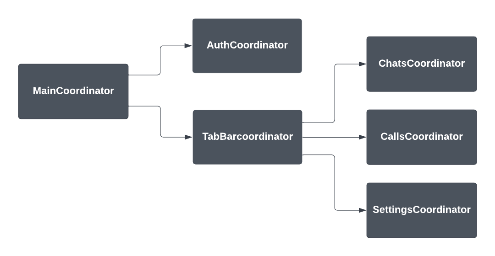
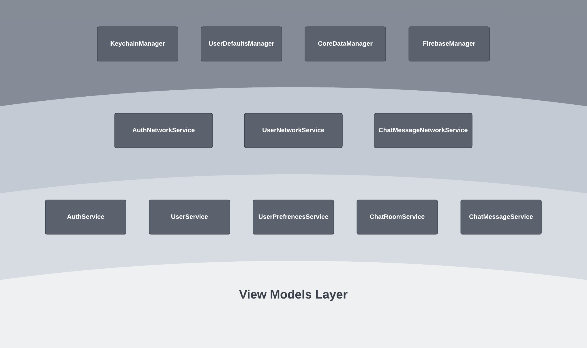

# Brief Description
**Connector is a text messaging and VOIP app that serves as my public code sample for whom it might interest.**  
  
  
> **Kindly note** that the app is still under development and is not intended for production, and that the only part that’s near production grade and is tested is the authentication; so, please be sure to direct most attention to the authentication view controllers and their related objects.\
> For more details check the [Non-Production Concessions & Cut Downs](https://github.com/AbdelrhmanElmhdy/connector/#non-production-concessions--cut-downs) illustrated below.

# Quick Core Flow Demo


# Brief Description of the Architecture

- ## Navigation 
    Navigation is handled by the coordinator pattern in accordance to the following diagram.
    
    

- ## Networking and Local Persistence 
     The app is built using a service oriented architecture that's comprised of four layers as shown in the following diagram.
     
     

    - The outer most layer *(the managers layer)* is responsible for interacting with the outside world by handling networking and local persistence in a generic and reusable way.
    - The inner most layer *(the view models layer)* is responsible for interacting with the user by handling inputs and displaying outputs.
    - Everything in between mainly provides the CRUD interface that contains all the queries needed by the view models.

- ## Dependency Management and Injection

  The application is built with the following dependency restrictions.

      1. Only view models and services may own service objects.
      2. View models may only own low level service objects.
      3. The firebase manager object may only be owned by a network service object (to decouple all networking code into a specific suite of objects).
      4. A network service may only be owned by its respective low level service.
      5. All services are interacted with through protocols that provide a public interface and facilitate switching to a different implementation or to a mock.
      6. All service and manager objects are singletons that are created and stored in a dependency container that’s directly owned by the app delegate.
      7. The injection of the low level services into the view models is conducted by some factory object that has access to the dependency container.

    > These restrictions have resulted in a great improvement of the maintainability and testability of the codebase.\
    > For example, when writing integration tests that should be independent and cause no side effects, only the managers may be mocked to disable persistence.


- ## Solving Massive-View-Controller Problem
  The massive view controllers were broken down by:

    - Using MVVM to extract out all the business logic and view state form the view controller.
    - Using the coordinator pattern to extract out all the navigation related code.
    - Extracting out all the view related code into a separate view object.
    - Extracting out the table-view's data source responsibility into a separate object.
    - Extracting out the view and view model binding code into a binder object that knows the details of the view and view model and binds them together.

  The view controller responsibilities are thus reduced to the following main five:

    - Playing the orchestrator that joins all the parts together and passes them the necessary data.
    - Initiate the data fetching through the view model or a managed-object-fetch-controller.
    - Responding to lifecycle, user, and network initiated events with the assist of the view model’s logic.
    - Configuring the navigation bar inside its life cycle methods.
    - Loading the view. *(of course)*
 
- ## Insuring Reusability
  Reusability is almost exploited to its maximum in the codebase to increase maintainability and development speed.\
  Some reusability examples include:
    
    - The table view data sources are extracted into separate reusable objects.
    - The auth view is reused by the login and signup views through inheritance.
    - The settings table view controller is designed for total reusability as all the settings screens are instances of the same view controller.
    - All overloaded methods delegate up, directly or indirectly, to a root method that implements the core logic.
    - The Keyboard avoidance logic is very generic and highly reusable.

- ## Commitment to Clean Coding Practices
  - All types, properties, methods, argument labels and variables are named following [Apple's API design guidelines](https://www.swift.org/documentation/api-design-guidelines/)
  - All methods have only one job to do.
  - All non-void methods must introduce no side effects.
  - Methods must rely, whenever possible, only on their received arguments.
  - Only event handler methods may be exempt from the single concern principle.
  - Event handler methods contain the highest abstraction level code, merely just performing function calls and updating properties.


> Event handler methods are all methods that are fired in response to some event. e.g. lifecycle events, user tap events and data fetch completion events.

  examples:

  LoginViewController.swift
  ```swift
  @objc private func didPressLogin() {
	  dismissKeyboard()
	  
	  viewModel.validateInputs()
	  guard viewModel.allInputsAreValid else { return }
	  
	  viewModel.isLoading = true
	  
	  // Commence login procedure.
	  viewModel.login(email: viewModel.email, password: viewModel.password)
	  	.receive(on: RunLoop.main)
	  	.sink(receiveCompletion: handleUserLoginCompletion, receiveValue: {})
	  	.store(in: &subscriptions)
  }
  ```
  LoginUITests.swift
  ```swift

  func testValidInputs() {
      controller.enter("Abdelrhman@test.com", in: .emailInput)
      controller.enter("Testtest1", in: .passwordInput)
  	
      controller.press(.loginButton)
  	
      expectAny(of: .noConnectionError, .userNotFoundError, .successfulAuthentication, timeout: 20)
  }

  ```

# Non-Production Concessions & Cut Downs
I have been working on and releasing multiple production apps, since 2018, that are collectively used by hundreds of thousands, and though not all were native iOS apps, but they all certainly did give me a lot of experience in covering up all the details that combine to offer a seamless and bug free user experience.

But since this app is not intended to ever make it to production and since time is expensive and must be spent wisely. I have cut down on the quality of the user experience and in some areas maybe, a little bit, on the quality of the code itself.

For example, I have advised to only take a look at the authentication view controllers and their related objects because that’s the most polished part of the code but I also called it “near” production grade because of the following reasons:

  - The auth screens perform real world input validations that are easy to modify and extend, but the validations are only client side.
  - There is no “Forgot Password” button that allows for password reseting via email (although firebase makes that a piece of cake).
  - Username existence is not checked at signup.

And the cut downs continue throughout the rest of the app. For example:

  - No in-app or push notifications are received upon the receipt of a new message.
  - Messages and chats cannot be deleted.
  - The only working setting in the settings screen is the dark mode preference.

# Testing
> For time conservation the testing was also narrowed down to the authentication related services, view models and view controllers.
- Tests are conducted by isolating the SUT and providing mock dependencies to perform a unit test, or by only mocking the managers and testing the view models with real service dependencies to perform an integration test.
- The view models and services go through open box unit and integration testing while the views and view controllers go through black box UI testing.
- All tests follow the FIRST test principles.
- The test coverage goal is ~85%, if it's to be production ready.
- All mock objects are auto generated using a [Sourcery](https://github.com/krzysztofzablocki/Sourcery) script.


# Feature Work
    
- Implement file and media sharing.
- Implement voice and video calling using webRTC, STUN & TURN servers and CallKit.
